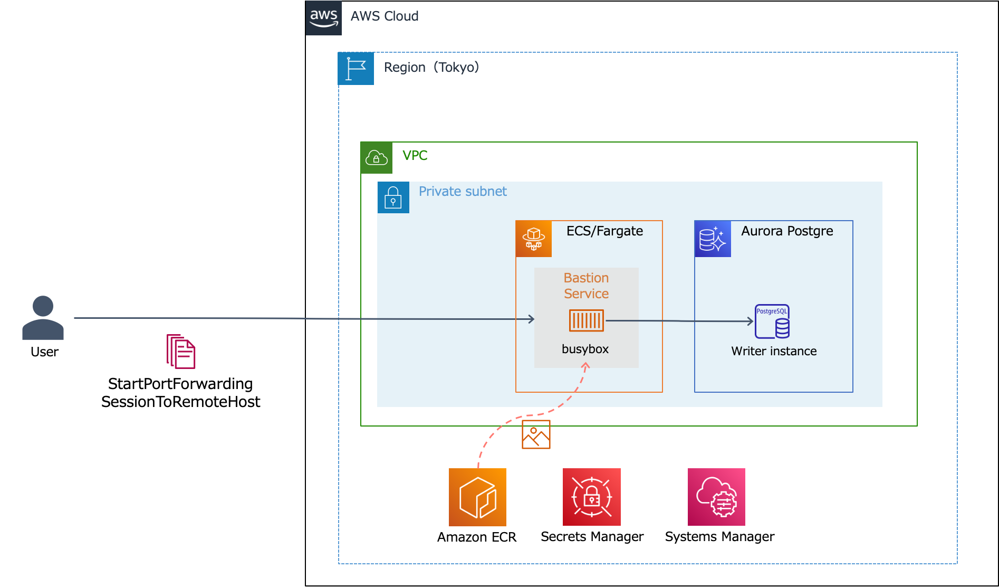

# FargateとSystems Manager ポートフォワーディングによるサーバレス踏み台

※[AWSの公式ブログ](https://aws.amazon.com/jp/blogs/news/use-port-forwarding-in-aws-systems-manager-session-manager-to-connect-to-remote-hosts-jp/)
の内容をFargateで実現するためのアセットをCDKで一括セットアップするためのサンプルコードです。  

## アーキテクチャイメージ



## デプロイ準備

上記のリソースをAWSにデプロイする方法をまとめます。
デプロイを実行する端末には、下記のソフトウェアが必要です。

- AWS CLI v2
- Node.js 14以上
- Docker

```shell
# CDKプロジェクト配下に移動
cd infra

# IaCの依存関係をインストール
npm ci

# CDKをデプロイ先のリージョンで使えるように初期化する（以下コマンドはap-northeast-1の例）
AWS_REGION=ap-northeast-1 npx cdk bootstrap
```
## デプロイ手順

**エラーとなった場合はコマンドを実行しているディレクトリが正しいことを確認してください**

```shell
# cdk-stackのデプロイ
npx cdk deploy  --require-approval never
```

## 以降作成中